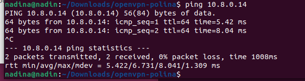
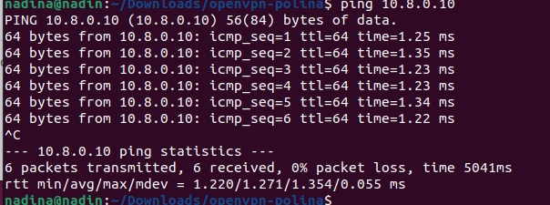
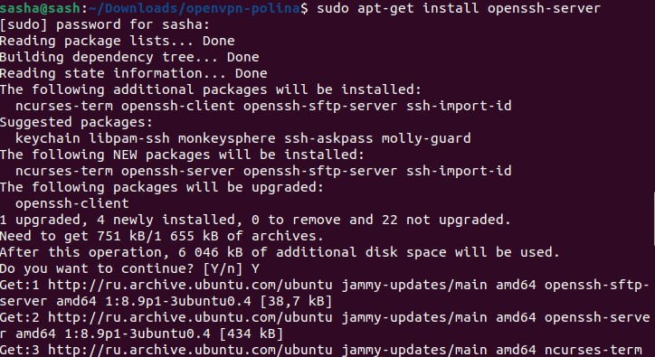
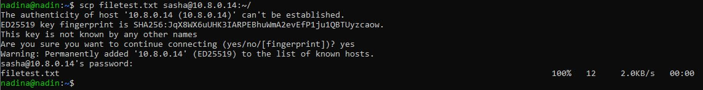
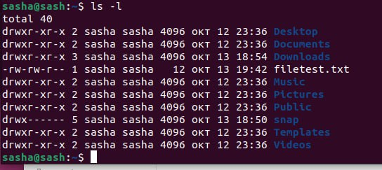

# Лабораторная работа №1

## 1. Подключение устройств к одной локальной сети

Подключили устройства к одной сети Wi-Fi, с помощью команды `ipconfig` нашли IP устройств:

|Компьютер|Имя|IP|
|----------|--|--|
|A|polina|10.8.0.10|
|B|nadina|10.8.0.6|
|C|sasha|10.8.0.14| 

С помощью команды `ping [IP]` проверили, видят ли компьютеры друг друга.





Все три устройства обнаружили друг друга, т.е. подключились к одной локальной сети.

## 2. Подключение к серверу по SSH

Установили openssh-server на все устройства с помощью команды 
```
sudo apt-get install openssh-server
```


С помощью терминала и пароля пользователя nadina на машине А установили соединение с машиной B по протоколу ssh:
```
ssh [имя пользователя]@[ip-адрес]
```


## 3. Создание и передача файла

С помощью команды `nano` создали текстовый файл.<br/><br/>
\
Содержимое файла:<br/><br/>


Через терминал на машине А передали файл с компьютера B на компьютер C, используя команду scp:
```
scp [путь к файлу] [имя пользователя]@[ip-адрес]:[путь назначения] 
```


Файл был успешно передан в домашнюю директорию пользователя sasha! :smile:<br/><br/>

