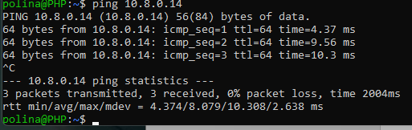
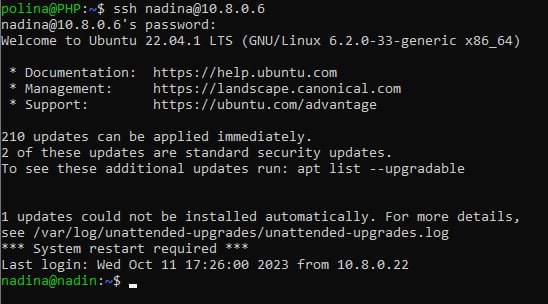
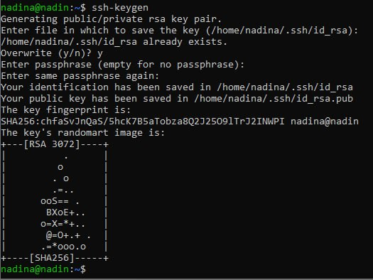
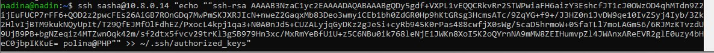

# Лабораторная работа №1

## 1. Подключение устройств к одной локальной сети

Подключили устройства к одной сети Wi-Fi, с помощью команды `ifconfig` нашли IP устройств:

|Компьютер|Имя|IP|
|----------|--|--|
|A|polina|10.8.0.10|
|B|nadina|10.8.0.6|
|C|sasha|10.8.0.14| 

С помощью команды `ping [IP]` проверили, видят ли компьютеры друг друга.




Все три устройства обнаружили друг друга, т.е. подключились к одной локальной сети.

## 2. Подключение к серверу по SSH

Установили openssh-server на все устройства с помощью команды 
```
sudo apt-get install openssh-server
```


С помощью терминала и пароля пользователя nadina на машине А установили соединение с машиной B по протоколу ssh:
```
ssh [имя пользователя]@[ip-адрес]
```


## 3. Создание и передача файла

С помощью команды `nano` создали текстовый файл.<br/><br/>
\
Содержимое файла:<br/><br/>


Через терминал на машине А передали файл с компьютера B на компьютер C, используя команду scp:
```
scp [путь к файлу] [имя пользователя]@[ip-адрес]:[путь назначения] 
```


Файл был успешно передан в домашнюю директорию пользователя sasha! :smile:<br/><br/>


# Задание со звёздочкой

Для выполнения использовались виртуальные машины, созданные в начале (имена и IP те же). 

### Настройка доступа по ключам

С помощью команды `ssh-keygen` сгенерировали ssh ключ на машине nadina. <br/><br/>
 <br/><br/>
Получившийся ключ:<br/><br/>
 <br/><br/>
Зашли на машину sasha и создали директорию .ssh (директория уже существовала ренее).<br/><br/>
 <br/><br/>
Создали файл authorized_keys для хранения ключа и добавили сгенерированный ключ.<br/><br/>
\
 <br/><br/>
Вернулись с машины sasha на nadina, после этого вернулись к машине polina.<br/><br/>
 <br/><br/>
Создали ключ на компьютере А.<br/><br/>
\
 <br/><br/>
Записали получившийся ключ в файл машины nadina (также заходим на компьютер и создаём файл). <br/><br/>
 <br/><br/>
Проверили вход без пароля с компьютера А на компьютер В и с компьютера В на компьтер С – успешно!<br/><br/>
\
 <br/><br/>
С машины nadina зашли на машину sasha и выполнили команду `echo`, которая добавляет ключ пользователя polina компьютеру С.<br/><br/>
 <br/><br/>
Ключ с компьютера А был успешно добавлен на другие компьютеры. Для пересылки файла с компьютера А зашли на компьтер В без пароля и переслали файл на компьютер С при помощи команды `scp` (пароль также не потребовался). <br/><br/>
\
\

Задание выполнено! :tada:
