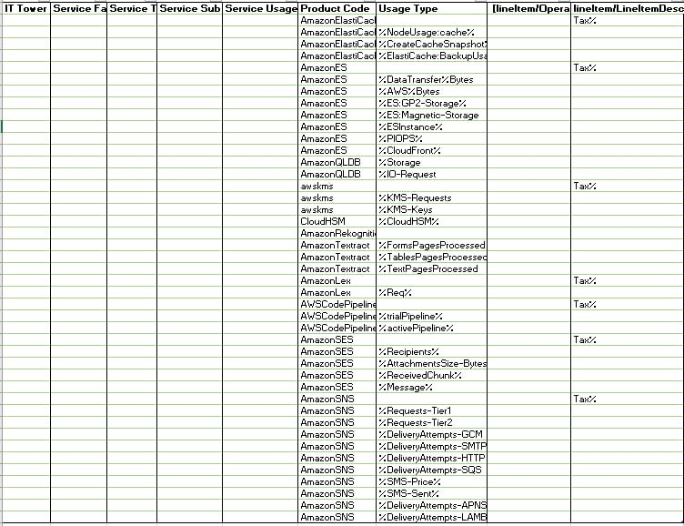

# Аналитическая лабораторная работа №1

## Цель работы
Знакомство с облачными сервисами. Понимание уровней абстракции над инфраструктурой в облаке. Формирование понимания типов потребления сервисов в сервисной-модели. Сопоставление сервисов между разными провайдерами. Оценка возможностей миграции на отечественные сервисы.
## Ход работы
### Исходные данные

### Классификация сервисов по типам и подтипам
| Тип или подтип | Описание |
| --- | --- |
| `IT Tower` | Группа, ответственная за управление инфраструктурой сервиса, его поддержку и характеристику. Примеры IT Tower - Storage, Machine Learning, Database, Security, Analytics, Compute|
| `Service Family` | Группа сервисов, которая выполняет конкретную инфраструктурную задачу и связана с конкретным приложением. Примеры Service Family - Application services, Management or provisioning, GPU-powered acceleration, In-memory caching service|
| `Service Type` | Тип сервиса внутри определенной группы сервисов. Примеры Service Type -  Elastic File System, Elastic Inference, ElastiCache, GuardDuty, Kinesis|
| `Service Sub Type` | Подтип сервиса с определенной функцией. Примеры Service Sub Type -- Fees, Acceleration, Cache Nodes, Security & Compliance и другие|
| `Service Usage Type` | Тип использования сервиса с учетом подтипа, также тип запросов, которые может выполнять пользователь с использованием конкретного сервиса. Примеры Service Usage Type - Standard Timed storage, Infrequent Access storage|

### Cервисы Amazon AWS и их аналоги
#### Amazon ElastiCache:

Аналог:
#### Amazon ES (Elasticsearch Service):

Аналог:
#### Amazon QLDB (Quantum Ledger Database):

Аналог:
#### AWS KMS (Key Management Service):

Аналог:
#### CloudHSM (Hardware Security Module):

Аналог:
#### Amazon Rekognition:

Аналог:
#### Amazon Textract:

Аналог:
#### Amazon Lex:

Аналог:
#### AWS Code Pipeline:

Аналог:
#### Amazon SES (Simple Email Service):

Аналог:
#### Amazon SNS (Simple Notification Service):

