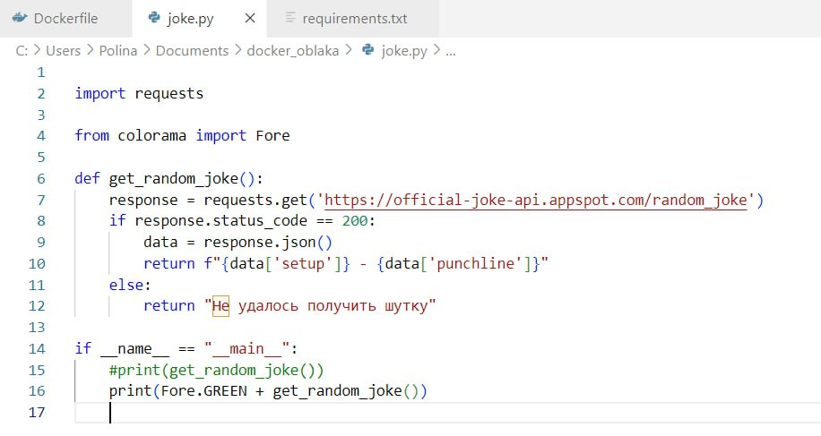
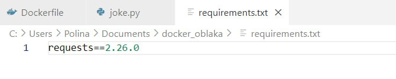
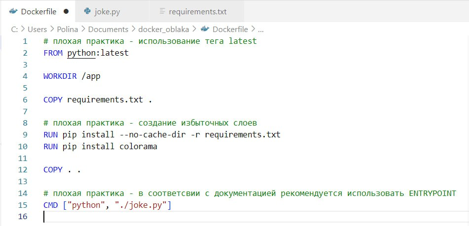
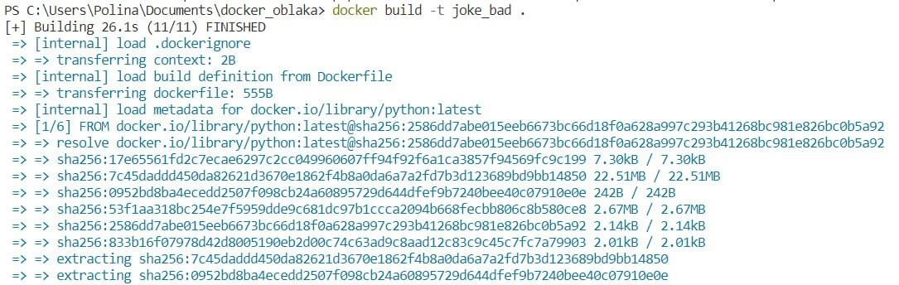
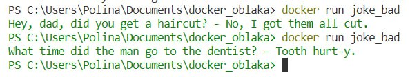
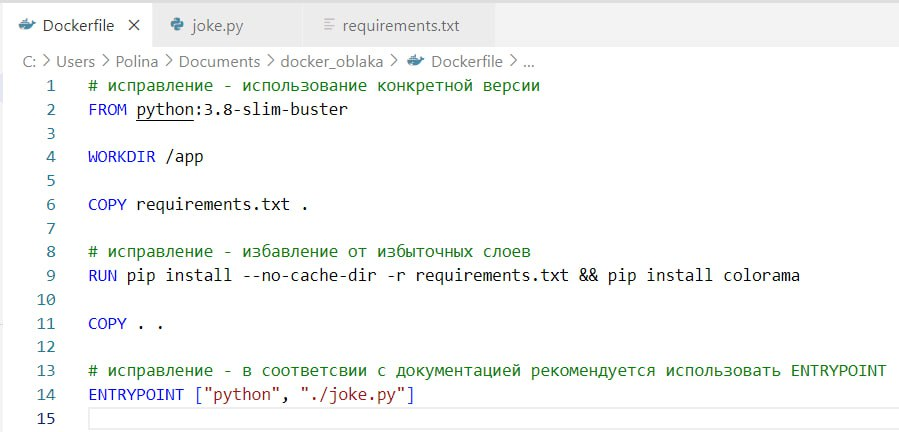
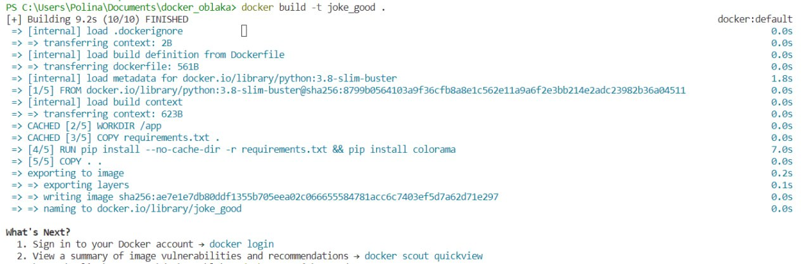
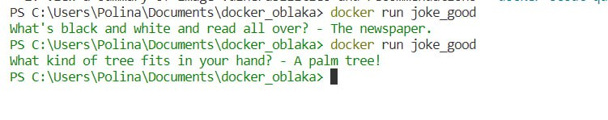

# Лабораторная работа №2

## Начало работы
Для выполнения данной лабораторной работы была написана программа на Python, которая обращается к сайту с шутками, сгенерированными нейросетью, и выводит в терминал одну из них <br/><br/>


Файл requirements.txt содержит список зависимостей Python, которые необходимы для программмы <br/><br/>


Основные команды, которые были использованы: <br/><br/>
```FROM ``` - Задаёт родительский образ \
```WORKDIR``` - Устанавливает рабочую директорию для инструкции CMD и ENTRYPOINT \
```RUN``` - Запускает команды, создаёт слой образа \
```COPY``` - Копирует файлы и директории в контейнер \
```CMD/ENTRYPOINT``` - указывает команду и аргументы для выполнения внутри контейнера/Предоставляет команды и аргументы для выполняющегося контейнера


## 2. Плохой Dockerfile


Этот Dockerfile содержит несколько плохих практик: 

1. **Использование тега latest**: Это может привести к непредсказуемым результатам, поскольку `latest` не гарантирует, что мы всегда будем использовать одну и ту же версию Python 

2. **Создание избыточных слоев**: Каждая команда `RUN` в Dockerfile создает новый слой в образе Docker. Чем больше слоев, тем больше становится размер образа, и тем дольше происходит его скачивание и развертывание 

3. **Использование CMD вместо ENTRYPOINT**: Это может быть проблемой, если мы хотим, чтобы образ был исполняемым файлом, который можно было бы запускать с различными аргументами <br/><br/>

Несмотря на наличие плохих практик, образ успешно собрался с помощью команды `docker build` <br/><br/>
 <br/><br/>
Подняли контейнер командой `docker run` - в терминале появилась шутка <br/><br/>


## 3. Хороший Dockerfile


Этот Dockerfile содержит исправленные практики:

1. **Использование конкретной версии Python**: В проекте была использована конкретная версия - `python:3.8-slim-buster` 

2. **Избавление от избыточных слоев**: Объединили команды pip install в одну строку, что уменьшает количество слоев в образе Docker и делает его более легким 

3. **Использование ENTRYPOINT вместо CMD**: Изменили команду, так как наш образ предназначен для конкретного проекта <br/><br/>

Образ также успешно собрался и запустился контейнер: <br/><br/>
  <br/><br/>


## Плохие практики по использованию контейнера

### Запуск контейнера с привилегиями root
Подобный может создать уязвимости безопасности, поскольку приложение внутри контейнера сможет получить полный контроль над хост-системой.

### Хранение секретов внутри контейнера

В целях сохранения безопасности данных не стоит хранить секреты внутри контейнера, стоит выбрать более безопасный способ хранения данных.


Задание выполнено! :tada:
