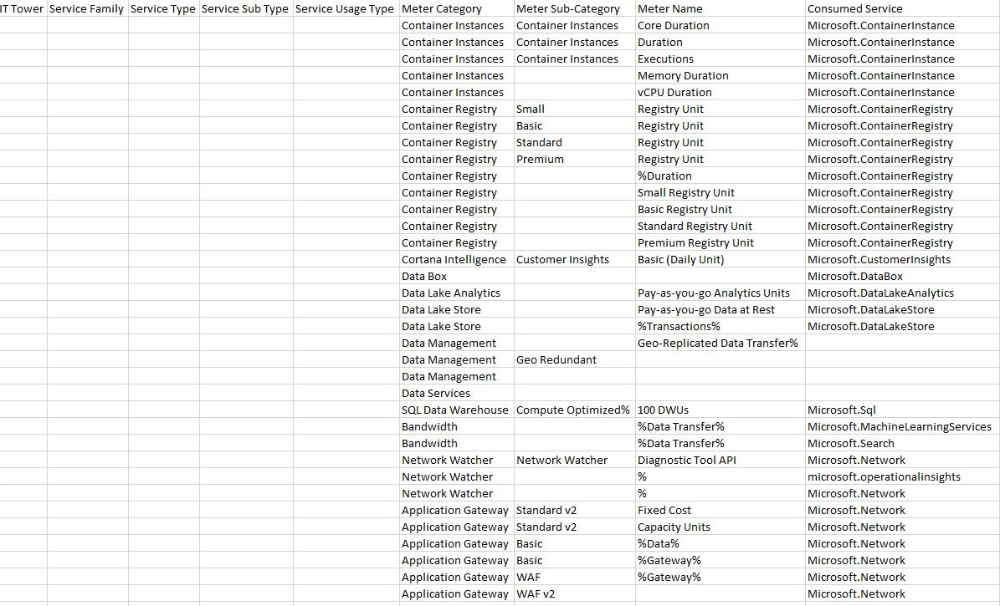
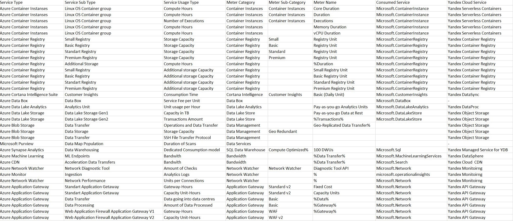

# Аналитическая лабораторная работа №2

## Цель работы
Знакомство с облачными сервисами. Понимание уровней абстракции над инфраструктурой в облаке. Формирование понимания типов потребления сервисов в сервисной-модели. Сопоставление сервисов между разными провайдерами. Оценка возможностей миграции на отечественные сервисы.
## Дано: 
1. Слепок данных биллинга от провайдера после небольшой обработки в виде SQL-параметров. Символ % в начале/конце означает, что перед/после него может стоять любой набор символов.
2. Google с документациями провайдера.
## Ход работы
### Исходные данные

### Классификация сервисов по типам и подтипам
| Тип или подтип | Описание |
| --- | --- |
| `IT Tower` | Группа, ответственная за управление инфраструктурой сервиса, его поддержку и характеристику. Примеры IT Tower - Storage, Machine Learning, Database, Security, Analytics, Compute|
| `Service Family` | Группа сервисов, которая выполняет конкретную инфраструктурную задачу и связана с конкретным приложением. Примеры Service Family - Application services, Management or provisioning, GPU-powered acceleration, In-memory caching service|
| `Service Type` | Тип сервиса внутри определенной группы сервисов. Примеры Service Type -  Elastic File System, Elastic Inference, ElastiCache, GuardDuty, Kinesis|
| `Service Sub Type` | Подтип сервиса с определенной функцией. Примеры Service Sub Type -- Fees, Acceleration, Cache Nodes, Security & Compliance и другие|
| `Service Usage Type` | Тип использования сервиса с учетом подтипа, также тип запросов, которые может выполнять пользователь с использованием конкретного сервиса. Примеры Service Usage Type - Standard Timed storage, Infrequent Access storage|

### Cервисы Azure и их аналоги
#### Azure Container Instances
Полностью управляемый сервис для развертывания и запуска контейнеризованных приложений в Azure. Он позволяет вам указать точное количество ядер процессора и объем памяти, необходимые вашему контейнеру, и автоматически выделяет ресурсы при развертывании.    
Аналог: Yandex Serverless Containers
##
#### Azure Container Registry
Полностью управляемый, геореплицированный реестр Docker и Open Container Initiative (OCI) изображений и артефактов.    
Аналог: Yandex Container Registry
##
#### Azure Cortana Intelligence
Полностью управляемый, геореплицированный реестр Docker и Open Container Initiative (OCI) изображений и артефактов.    
Аналог: Yandex DataSync
##
#### Azure Data Box
Устройство, которое перемещает данные в Azure, когда сети заняты или дороги. Он шифрует данные, стирает их после загрузки и соответствует стандартам безопасности.     
Аналог: не найден
##
#### Azure Data Lake Analytics
Сервис аналитики по запросу, который упрощает разработку и обработку больших данных на петабайтах данных.    
Аналог: Yandex DataProc 
##
#### Azure Data Lake Store
Облачное хранилище данных, которое позволяет хранить и анализировать файлы петабайтного размера и триллионы объектов в любом формате для большой аналитики данных. Он является частью Azure Data Lake, решения для облачного хранилища данных, которое включает Data Lake Analytics, HDInsight и Data Lake Store, и интегрируется с вашими существующими ИТ-инвестициями и источниками данных.    
Аналог: Yandex Object Storage
##
#### Azure Data Management
Решение для управления и управления данными в вашем облаке и гибридных средах. Оно включает в себя такие сервисы, как Azure SQL Database, Azure Synapse Analytics, Azure Purview, Azure Data Factory и другие.    
Аналог: Yandex Object Storage
##
#### Azure Data Services
Набор сервисов, которые помогают вам создавать облачные приложения и решения с анализом данных, хранением данных и искусственным интеллектом.    
Аналог: не найден 
##
#### Azure SQL DW
Полностью управляемый облачный сервис для аналитики больших данных на основе SQL. Он позволяет легко создавать и запускать сложные запросы и отчеты на петабайтах структурированных и полуструктурированных данных.     
Аналог: Yandex Managed Service for YDB  
##
#### Azure Bandwidth
Объем данных, который перемещается в и из центров обработки данных Azure, а также между центрами обработки данных Azure. За этот объем данных взимается плата в зависимости от региона источника и назначения. Некоторые переводы явно покрываются другими сервисами, такими как Content Delivery Network, ExpressRoute или Peering.    
Аналог:  Yandex DataSphere или Yandex Cloud CDN

##
#### Azure Network Watcher
Сервис для мониторинга и диагностики сетевой производительности и безопасности в Azure. Он позволяет проверять доступность и достижимость ресурсов, анализировать трафик и потоки данных, настраивать сетевые журналы и оповещения, и многое другое.    
Аналог:  Yandex Monitoring  

##
#### Azure Application Gateway
Веб-шлюз уровня приложения, который обеспечивает балансировку нагрузки, безопасность и маршрутизацию для веб-приложений.    
Аналог:  Yandex API Gateway  

## Итоговая таблица 

## Вывод  
 В ходе выполнения данной работы мы ознакомились с облачными сервисами Azure. Yandex Cloud предлагает широкий спектр аналогичных сервисов и продуктов, которые могут быть использованы в качестве замен Azure-сервисов. При сопоставлении сервисов пришли к выводу о том, что миграция из Amazon AWS в Yandex Cloud возможна, однако Не все сервисы имеют прямые аналоги в Yandex Cloud, поэтому может потребоваться адаптация или замена некоторых компонентов инфраструктуры.   

Задание выполнено! :tada:
